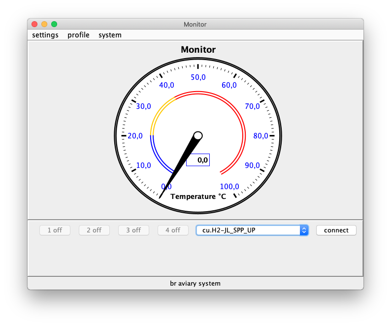

# Br aviary system

Desktop java application that displays data collected from ds18b20 temperature sensors and displays in a real-time graph. 

## 🚀 Description

The purpose of br-aviary-system is to be a real-time temperature monitor. The application is a study of the communication between a java desktop application and arduino uno r3.
In addition to displaying the temperature in real time, it is possible to control four relays connected to the Arduino.
The idea is to implement an automatic mode that can receive the maximum and minimum temperature data as parameters, making it possible to turn the relays on and off automatically.

---
[Linkedin](https://www.linkedin.com/in/wellitonfernandes/) 😊